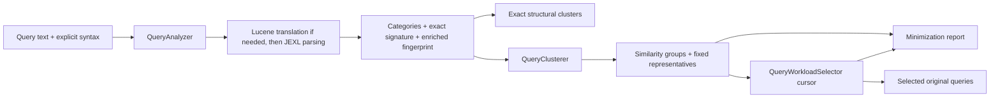

# QueryAnalyzer: analysis, workload minimization, and tuning

## Overview

`datawave.query.analysis.QueryAnalyzer` analyzes Lucene and JEXL query text offline. It categorizes queries, extracts fields and functions, and groups queries by their value-independent structure. Companion classes add similarity-based grouping, incremental workload selection, and reports that explain the resulting reduction and coverage.

Use the feature to inventory a query history, identify recurring structures, or choose a smaller workload for testing and benchmarking. It uses DataWave's parsers without accessing metadata, planning queries, or executing them. A successful analysis establishes that the expression is supported by the analyzer; it does not establish schema validity, index availability, equivalent results, or equivalent execution cost. For example, `NAME == 'alice'` and `NAME == 'bob'` share a structure but can return different documents.

The implementation is in the `datawave-query-core` module and targets Java 11. There is no feature-specific REST endpoint or command-line application in this package; applications supply query lists through the Java API.

| API | Purpose | Result |
| --- | --- | --- |
| `QueryAnalyzer.analyze(...)` | Parse, categorize, and extract structure | Immutable `AnalysisReport`, including one `QueryAnalysis` per input and exact structural clusters |
| `QueryAnalysis.getFingerprint()` | Inspect enriched syntactic features | Immutable version-2 `QueryFingerprint` |
| `QuerySimilarity.compare(...)` | Explain a pair's similarity and compatibility | Score, component scores, and protected differences |
| `QueryClusterer.cluster(...)` | Group compatible fingerprints around fixed representatives | Immutable groups and clustering diagnostics |
| `QueryWorkloadSelector.cursor(...)` | Select queries in balanced, approximately diverse rounds | Mutable cursor emitting distinct original text/syntax identities |
| `QueryAnalyzer.summarizeMinimization(...)` | Describe grouping or snapshot selection progress | Immutable `QueryMinimizationReport` with structured statistics and `describe()` |
| `QueryAutoTuner.tune(...)` | Learn a grouping policy from labeled examples | Versioned configuration, fit metrics, split details, and diagnostics |
| `QueryTuningJson` | Read labeled examples and read/write clustering settings | Strict versioned JSON contracts with published schemas |

## How analysis works



### Parsing and per-input results

Supply `Syntax.LUCENE` or `Syntax.JEXL` explicitly. Syntax guessing is intentionally absent because it could reinterpret malformed JEXL as Lucene. Lucene passes through `LuceneToJexlQueryParser`, then the resulting JEXL is parsed by `JexlASTHelper`. JEXL input goes directly to the latter parser.

`analyze(List<String>, Syntax)` handles a batch in one syntax. `analyze(List<QueryInput>)` handles mixed syntax. Results retain zero-based input indexes and input order, including duplicate occurrences.

| Status | Meaning | Example |
| --- | --- | --- |
| `SUCCESS` | Parsing and supported structural analysis completed | `NAME == 'alice'` |
| `INVALID` | Missing text/syntax or a parsing failure | Blank text, `A ==`, or a Lucene field rejected by the configured parser |
| `UNSUPPORTED` | Parsed expression uses a structure the analyzer does not support | Ordinary assignment `A = 'x'`, method call `A.size() > 0`, or a malformed property marker |

Expected parse and unsupported-expression failures are isolated to individual entries. Failed entries have an error message, null JEXL/signature/fingerprint, and empty category/field/function sets. They remain in `getQueries()` and are excluded from clusters and workload selection. Null batch arguments and a null syntax argument to the single-syntax overload throw `NullPointerException` rather than creating an entry.

For successful entries:

- `getInput()` preserves the original query text and syntax.
- `getJexl()` returns original JEXL or the Lucene parser's translation, with literal values retained.
- `getSignature()` returns a structural key. It is not executable query text.
- `getCategories()`, `getFields()`, and `getFunctions()` describe syntactic features.
- `getFingerprint()` exposes enriched features and any enrichment diagnostics.

### Categories, fields, and functions

Categories are multi-valued. For example, `A != null` has `EQUALITY`, `NEGATION`, and `NULL_CHECK`.

| Category | Trigger |
| --- | --- |
| `EQUALITY` | `==` or `!=` |
| `RANGE` | `<`, `<=`, `>`, or `>=` |
| `REGEX` | `=~` or `!~` |
| `NEGATION` | `!`, `!=`, or `!~` |
| `CONJUNCTION`, `DISJUNCTION` | Ordinary AND / OR junctions |
| `FUNCTION` | Namespaced function invocation |
| `CONTENT` | Function in the `content` namespace |
| `GEOSPATIAL` | Function in the `geo` or `geowave` namespace |
| `NULL_CHECK` | Equality or inequality with `null` |
| `UNFIELDED` | `_ANYFIELD_`, including translated unfielded Lucene queries |
| `PROPERTY_MARKER` | Recognized DataWave query property marker |
| `OTHER` | Boolean literal or otherwise uncategorized supported expression |

Function categories describe invocation syntax. For example, `filter:includeRegex(NAME, 'al.*')` receives `FUNCTION`; the regex argument is additionally classified in its fingerprint. Category names do not assert planner decisions or validate function availability.

Field identifiers preserve case and grouping context, such as `NAME`, `name`, and `NAME.1`. The analysis field set excludes `_ANYFIELD_`, property-marker identifiers, and `termOffsetMap` when used as the content-function variable. Function names include namespaces, such as `filter:includeRegex`. A quoted content zone is a string literal in the exact analysis; the enriched fingerprint also recognizes it as a field binding for known content functions.

### Exact structural clusters

`AnalysisReport.getClusters()` groups successful entries by `QueryAnalysis.getSignature()`. Signatures:

- Replace string and numeric literals, including signed numeric literals, with the same `VALUE` placeholder.
- Flatten associative AND/OR junctions and sort their children, preserving the distinction between AND and OR and mixed Boolean grouping.
- Preserve field identifiers, operators, operand and function-argument order, repeated predicates, null/Boolean literals, and marker types.
- Encode components with length prefixes to avoid ambiguous concatenation.

Examples:

| Queries | Same exact signature? | Reason |
| --- | --- | --- |
| Lucene `NAME:alice`; JEXL `NAME == 'bob'` | Yes with the default parser | Translation yields the same equality structure |
| `AGE >= '10'`; `AGE >= 20` | Yes | String and numeric values share a placeholder |
| `A == 1 && (B == 2 && C == 3)`; `C == 9 && A == 8 && B == 7` | Yes | AND is flattened and sorted |
| `A == 1 && (B == 2 || C == 3)`; `(A == 1 && B == 2) || C == 3` | No | Boolean topology differs |
| `NAME =~ 'al.*'`; `NAME =~ '.*al.*'` | Yes | Exact signatures abstract regex strings |
| `A == null`; `A == 'null'` | No | Null is retained |
| Marked bounded range; the same comparisons without a marker | No | Marker type is retained |

The cluster map is ordered by signature; members within each exact cluster retain input order. These clusters have no threshold or tuning options.

### Enriched fingerprints and protected profiles

Fingerprints retain more detail than exact signatures. `getVersion()` currently returns `2`; `getKey()` starts with `qf2:` and contains a SHA-256 digest of the enriched signature and protected profile. Treat keys as versioned identifiers, not executable queries or predictions of an execution plan.

| Fingerprint property | Information |
| --- | --- |
| `getSignature()` | Enriched structure, including field names, regex literal lengths, and known numeric controls |
| `getBindings()` | Fields bound to operator, Boolean, and function-argument contexts |
| `getCounts()` | Context-sensitive operation counts and numeric-control buckets |
| `getTopology()` | Structural paths and argument roles |
| `getMeasurements()` | Predicate/field counts, repeated field uses, Boolean depth, maximum junction width, function-argument count, regex prefix/suffix lengths, and control magnitude |
| `getProtectedProfile()` | Conservative compatibility boundary |
| `getProtections()` | Readable tokens that help explain the boundary |
| `getDiagnostics()` | Features that could not be confidently classified |

Ordinary search values are abstracted. Protected profiles generalize ordinary field names to field roles and collapse repeated identical child profiles within an AND/OR. This allows comparisons such as a two-predicate conjunction versus a three-predicate conjunction. Bindings and counts still measure their differences. Profiles preserve Boolean structure, operator and operand roles, markers, function identity and arity, reserved `_ANYFIELD_`/`_NOFIELD_` roles, and selected literal characteristics.

Regex classification distinguishes `LITERAL`, `PREFIX`, `SUFFIX`, `BOTH`, and `UNANCHORED` using `JavaRegexAnalyzer`. For example, `'al.*'` and `'.*al.*'` have different profiles and cannot share a similarity group. `'al.*'` and `'alice.*'` share an access class but have different enriched keys and complexity measurements.

Function-specific enrichment covers:

- `filter:includeRegex`, `filter:excludeRegex`, and `filter:getAllMatches`: regex access class and literal lengths.
- `filter:matchesAtLeastCountOf`: numeric minimum and regex arguments.
- `filter:compare`: comparison operator and `ANY`/`ALL` mode; `=` normalizes to `==` and the mode to uppercase.
- `content:within`, `content:phrase`, and `content:adjacent`: argument roles, zones, term count, and the numeric distance for `within`.

Numeric controls retain their actual normalized value in enriched signatures; their role is protected while count buckets and logarithmic magnitude affect similarity. Different `within` distances can therefore remain compatible. Other functions retain name, arity, and ordered argument shapes without additional interpretation of literal controls, including geospatial coordinates.

Unknown regex/control semantics and uncertain bounded-range classification add diagnostics and a digest of the rendered JEXL to the protected profile. Such entries can remain `SUCCESS`, but different rendered expressions are conservatively kept apart. Inspect diagnostics separately from status: an invalid regex string can parse as JEXL and still produce a successful analysis with an uncertain fingerprint.

### Similarity and bounded grouping

`QuerySimilarity.compare(left, right)` returns a score in `[0, 1]`, compatibility, named component scores, and protected differences. The default score is:

```text
score = 0.35 * bindings
      + 0.30 * counts
      + 0.20 * topology
      + 0.15 * complexity
```

`QuerySimilarity.compare(left, right, weights)` and `distance(left, right, weights)` use explicit normalized `QuerySimilarity.Weights`. Clustering accepts the same immutable weights through its options, and workload selection inherits them from the clustering result.

Bindings and topology use set Jaccard overlap. Counts use summed minima divided by summed maxima. Complexity averages the ratio of smaller to larger measurements, treating two zeros as equal. Compatibility requires identical protected profiles, independently of the numeric score; an incompatible pair can have a high score.

`QueryClusterer` first buckets identical enriched keys, then processes those buckets in key order. It partitions representatives by protected profile and discovers candidates using field-binding/topology postings plus a bounded fallback set. Search features are ordered by increasing frequency across unique fingerprints, with stable tie breaks. Candidate ranking uses posting hits and group ID. The highest-scoring qualifying representative receives the bucket; otherwise a new group is created.

Every member meets the threshold against its group's fixed representative. Pairwise similarity between all members is not guaranteed, and representatives are not recomputed as medoids. Bounded discovery can split fingerprints that would qualify if compared. Identical fingerprints always receive one assignment within a run. Groups and representatives are deterministic for the same inputs, parser configuration, and options, even when input order changes; indexes reflect the current input order. Changing options or the input set can change group identities and representatives.

### Incremental workload selection

A selector cursor emits one representative per group in round 1, then one remaining query per active group per round. Within its bounded candidate window, it favors the query with the largest minimum distance to retained landmarks. Unvisited enriched fingerprints take precedence over further literal variants within a group. Ties use stable group and query identities.

Distance is `0.4 * (1 - score)` for compatible profiles and `0.6 + 0.4 * (1 - score)` for different profiles. This favors protected differences. Landmarks comprise the configured first and recent selections plus the candidate group's representative after that group has started. The first selection has no landmarks, so its initial distance of 1 is excluded from diversity statistics.

Selection deduplicates exact original text **and syntax**, without trimming, case folding, or semantic normalization. Lucene and JEXL inputs that translate to the same expression remain distinct identities. Each `Selection` retains all original indexes and an occurrence count. Fully draining a cursor emits every distinct successful identity once; it only reduces the workload further when the caller stops after a chosen prefix. Calling `take(groupCount)` on a fresh cursor completes the representative round.

## Usage examples

### Analyze a mixed query history and select representatives

The following complete example runs in an application with `datawave-query-core` and its dependencies on the classpath. For a separate Maven application, the artifact is `gov.nsa.datawave:datawave-query-core`; use the version matching your DataWave build.

```java
import java.util.Arrays;
import java.util.List;

import datawave.query.analysis.QueryAnalyzer;
import datawave.query.analysis.QueryAnalyzer.AnalysisReport;
import datawave.query.analysis.QueryAnalyzer.QueryAnalysis;
import datawave.query.analysis.QueryAnalyzer.QueryInput;
import datawave.query.analysis.QueryAnalyzer.Status;
import datawave.query.analysis.QueryAnalyzer.Syntax;
import datawave.query.analysis.QueryClusterer;
import datawave.query.analysis.QueryMinimizationReport;
import datawave.query.analysis.QueryWorkloadSelector;

public class QueryAnalyzerExample {
    public static void main(String[] args) {
        QueryAnalyzer analyzer = new QueryAnalyzer();
        AnalysisReport analysis = analyzer.analyze(Arrays.asList(
                new QueryInput("NAME:alice", Syntax.LUCENE),
                new QueryInput("NAME == 'bob'", Syntax.JEXL),
                new QueryInput("NAME:alice", Syntax.LUCENE),
                new QueryInput("NAME =~ 'al.*'", Syntax.JEXL),
                new QueryInput("NAME =~ '.*al.*'", Syntax.JEXL),
                new QueryInput("A ==", Syntax.JEXL)));

        for (QueryAnalysis query : analysis.getQueries()) {
            if (query.getStatus() != Status.SUCCESS) {
                System.out.printf("Input %d: %s: %s%n",
                        query.getIndex(), query.getStatus(), query.getError());
                continue;
            }
            System.out.printf("Input %d: categories=%s fields=%s functions=%s%n",
                    query.getIndex(), query.getCategories(),
                    query.getFields(), query.getFunctions());
            if (!query.getFingerprint().getDiagnostics().isEmpty()) {
                System.out.println(query.getFingerprint().getDiagnostics());
            }
        }

        System.out.println("Exact families: " + analysis.getClusters().size());
        QueryClusterer.Result groups = new QueryClusterer().cluster(analysis);
        System.out.println(analyzer.summarizeMinimization(groups).describe());

        QueryWorkloadSelector.Cursor cursor = new QueryWorkloadSelector().cursor(groups);
        List<QueryWorkloadSelector.Selection> representatives =
                cursor.take(groups.getGroups().size());
        for (QueryWorkloadSelector.Selection selected : representatives) {
            System.out.printf("Group %s, round %d, indexes %s: %s%n",
                    selected.getGroupId(), selected.getRound(),
                    selected.getInputIndexes(), selected.getQuery().getInput().getQuery());
        }

        QueryMinimizationReport snapshot = analyzer.summarizeMinimization(cursor);
        System.out.println(snapshot.describe());
        // Continue the same sequence later; an exhausted cursor returns an empty list.
        List<QueryWorkloadSelector.Selection> nextBatch = cursor.take(100);
        System.out.println("Additional distinct queries: " + nextBatch.size());
    }
}
```

With the default parser/options, this example has six inputs, five successes, one invalid input, two exact structural families, three enriched fingerprints, and three similarity groups. Four successful text/syntax identities remain after deduplication. The first three selections cover all groups; the fourth identity appears in a later round. The two identical Lucene occurrences are represented by one selection carrying indexes `[0, 2]`.

Use `selected.getQuery().getInput()` when downstream code accepts the original syntax, or `selected.getQuery().getJexl()` when it expects JEXL. Actual planning/execution remains the responsibility of that downstream code.

### Single-syntax analysis and pairwise explanation

```java
QueryAnalyzer analyzer = new QueryAnalyzer();
QueryAnalyzer.AnalysisReport report = analyzer.analyze(
        java.util.Arrays.asList("A == 1 && B == 2", "A == 1 && B == 2 && C == 3"),
        QueryAnalyzer.Syntax.JEXL);

// These particular inputs both succeed. Check status for arbitrary input histories.
datawave.query.analysis.QuerySimilarity.Result similarity =
        datawave.query.analysis.QuerySimilarity.compare(
                report.getQueries().get(0).getFingerprint(),
                report.getQueries().get(1).getFingerprint());
System.out.println("Score: " + similarity.getScore());
System.out.println("Compatible: " + similarity.isCompatible());
System.out.println("Components: " + similarity.getComponents());
System.out.println("Protected differences: " + similarity.getProtectedDifferences());
```

These inputs have different exact signatures and enriched keys, share a protected profile, and meet the default 0.70 similarity threshold.

### Match the deployment's Lucene parser

```java
datawave.query.language.parser.jexl.LuceneToJexlQueryParser parser =
        new datawave.query.language.parser.jexl.LuceneToJexlQueryParser();
parser.setAllowedFields(java.util.Collections.singleton("NAME"));
QueryAnalyzer analyzer = new QueryAnalyzer(parser);

QueryAnalyzer.AnalysisReport report = analyzer.analyze(
        java.util.Arrays.asList("CITY:paris", "NAME:alice"),
        QueryAnalyzer.Syntax.LUCENE);
// CITY is INVALID under this allowed-field policy; NAME succeeds.
```

Also match tokenized fields, text analyzer, unfielded tokenization, leading-wildcard policy, slop/position behavior, and allowed Lucene functions when they differ from defaults. These settings affect translation and therefore signatures and grouping. Parser restrictions apply to Lucene translation; supplying JEXL directly does not invoke the Lucene allowed-field/function policies.

Configure the parser before constructing/using the analyzer and do not mutate it or its supplied collections during analysis. Analyzer calls are serialized on an instance because its parser may not be thread safe. For concurrent batches, use independent analyzer/parser instances rather than sharing a configured parser across them.

## Reading minimization reports

`summarizeMinimization(groups)` contains clustering statistics and an empty `getSelection()`. The cursor overload adds selection statistics at the current position without advancing the cursor, rerunning parsing/grouping, or doing similarity comparisons. Old snapshots remain unchanged after subsequent selections. Reporting still builds and sorts aggregate statistics, so it has a cost even though it does no new comparisons.

`getClustering()` includes input/status counts, distinct identities, duplicate occurrences, exact-family/fingerprint/group/profile counts, group-size distributions, similarity summaries, options, comparison counts, and discovery diagnostics. `getGroups()` and `getProfiles()` provide complete structured summaries. Group category/field/function/protection sets describe the representative rather than a union of every member.

`describe()` renders a deterministic, locale-independent summary. It highlights up to five largest groups and five weakest groups containing multiple fingerprints, removing repeated IDs. It omits original query text but includes representative fields, functions, protections, and profiles.

| Statistic | Interpretation |
| --- | --- |
| Duplicate occurrences | Successful occurrences minus distinct original text/syntax identities |
| Potential occurrence reduction | `1 - groupCount / successfulCount`, assuming one representative per group |
| Potential distinct-query reduction | `1 - groupCount / distinctQueryCount`, separating grouping from exact duplicates |
| Representative minimum/mean similarity | One contribution per enriched fingerprint, including the representative at 1; duplicate/literal variants do not add weight |
| Occurrence / distinct-query distributions | Group sizes with nearest-rank p50/p95 and singleton counts |
| Group / fingerprint / profile coverage | Fraction touched by selections actually emitted |
| Distinct-query coverage | Emitted count divided by successful distinct identities |
| Occurrence coverage | Occurrences of emitted identities, including their exact duplicates, divided by successful occurrences |
| Diversity minimum/mean | Observed bounded-landmark distance after the first selection |

Invalid and unsupported entries are outside reduction and coverage denominators. Selecting a representative touches its group but does not count all group members as emitted occurrence coverage. Empty distributions and zero denominators use `OptionalDouble.empty()` and print `n/a`; before two selections, diversity statistics are also absent.

For structured access, extending the complete example above:

```java
QueryMinimizationReport progress = analyzer.summarizeMinimization(cursor);
QueryMinimizationReport.ClusteringStats clustering = progress.getClustering();
System.out.println("Groups: " + clustering.getGroupCount());
System.out.println("Candidate truncations: "
        + clustering.getCandidateTruncatedFingerprintCount());
progress.getSelection().ifPresent(selection -> {
    System.out.println("Emitted: " + selection.getEmittedCount());
    selection.getGroupCoverage().ifPresent(coverage ->
            System.out.printf("Group coverage: %.1f%%%n", 100 * coverage));
    selection.getOccurrenceCoverage().ifPresent(coverage ->
            System.out.printf("Occurrence coverage: %.1f%%%n", 100 * coverage));
});
```

## Tuning guide

Options are immutable constructor arguments. Start with default options and record the report for a representative history. You can adjust parameters explicitly or use labeled examples to tune a reusable clustering configuration. Tune grouping separately from selection so you can identify which change affected the result.

### Automatic tuning from labeled queries

`QueryAutoTuner` learns a threshold and four similarity weights from 1–9999 raw query examples. Each `QueryTuningSample` has a nonblank query, explicit `LUCENE` or `JEXL` syntax, a nonblank desired `bucket`, and optionally a nonblank unique `id`. Text, IDs, and labels retain their exact spelling and whitespace. A bucket means “these examples should group together”; labels guide future grouping through learned settings and are not stored as named classifications for future queries.

The tuner parses the samples once through the `QueryAnalyzer` supplied to its constructor. Reuse that analyzer, with the same deployment-configured parser, when applying the configuration to new queries. Saved JSON does not contain allowed fields, functions, tokenization, wildcard policies, or other parser settings. Changing those settings can change fingerprints and grouping even when clustering settings stay the same.

```java
datawave.query.language.parser.jexl.LuceneToJexlQueryParser parser =
        new datawave.query.language.parser.jexl.LuceneToJexlQueryParser();
// Apply deployment-specific parser settings here, before analysis or tuning.
QueryAnalyzer analyzer = new QueryAnalyzer(parser);
List<QueryTuningSample> samples = QueryTuningJson.readSamples(
        java.nio.file.Paths.get("labeled-queries.json"));
QueryAutoTuner.Result tuning = new QueryAutoTuner(analyzer).tune(samples);
QueryTuningConfiguration configuration = tuning.getConfiguration();
QueryTuningJson.writeConfiguration(
        java.nio.file.Paths.get("query-clustering.json"), configuration);

System.out.println("Training F1: " + tuning.getTrainingFit().getF1());
System.out.println("Baseline training F1: " + tuning.getBaselineTrainingFit().getF1());
tuning.getHoldoutFit().ifPresent(fit ->
        System.out.println("Holdout F1: " + fit.getF1()));
System.out.println("Excluded samples: "
        + tuning.getDiagnostics().getExcludedSamples().size());
System.out.println("Evaluations: " + tuning.getSearch().getEvaluationCount());

// Later, analyze new raw queries with the same analyzer/parser configuration.
QueryTuningConfiguration restored = QueryTuningJson.readConfiguration(
        java.nio.file.Paths.get("query-clustering.json"));
List<QueryAnalyzer.QueryInput> newQueries = java.util.Arrays.asList(
        new QueryAnalyzer.QueryInput("NAME:carol", QueryAnalyzer.Syntax.LUCENE),
        new QueryAnalyzer.QueryInput("NAME == 'dave'", QueryAnalyzer.Syntax.JEXL));
QueryAnalyzer.AnalysisReport future = analyzer.analyze(newQueries);
QueryClusterer.Result groups = new QueryClusterer().cluster(
        future, restored.toClusteringOptions());
QueryWorkloadSelector.Cursor cursor = new QueryWorkloadSelector().cursor(groups);
```

`new QueryAutoTuner.Options(baseline, maxEvaluations)` supplies a starting `QueryClusterer.Options` and a positive evaluation cap; `new QueryAutoTuner.Options()` uses the standard clustering defaults and 128 evaluations. Pass these options to `tune(samples, options)`. The baseline is evaluated first. The deterministic search visits thresholds on a 0.1 grid with baseline, equal, and single-component weight seeds, then refines thresholds and transfers weight between components. The cap includes baseline and distinct training evaluations; duplicate configurations are skipped. Tie-breaking favors proximity to baseline settings, then less comparison work, then fixed numeric ordering. This is a bounded search with no optimality guarantee.

Only the threshold and weights change. Protected-profile boundaries remain mandatory, and `featureLimit`, `postingLimit`, and `candidateLimit` retain their baseline values. Candidate discovery remains bounded, so a chosen policy can still split otherwise compatible examples. Selection options are separate. Auto-tuning does not relax parsing restrictions or establish execution equivalence.

The objective is fingerprint-balanced B-cubed F1: each distinct successful enriched fingerprint contributes one unit, irrespective of duplicate occurrences and literal variants. Precision penalizes groups mixing labels; recall penalizes labels split across groups; F1 is their harmonic mean. If an identical fingerprint has several distinct labels, its unit mass is divided equally between those labels. Duplicate occurrences do not increase a label's vote. Such contradictions remain in training and are reported rather than silently assigned a winning label. A desired bucket spanning different protected profiles also cannot become one group; the tuner returns a best-effort policy with conflict diagnostics.

Validation holds out complete fingerprint groups so variants of the same structure cannot leak across the split. A label is eligible when it has at least four conflict-free fingerprints. Validation requires at least two eligible labels. For each eligible label, a deterministic hash ordering reserves approximately 20% (rounded down), with at least two holdout and two training fingerprints. Ineligible labels and conflicting fingerprints remain in training and appear in split details. When eligibility is insufficient, all fingerprints are used for training, `getHoldoutFit()` is empty, and `getSplit().isValidationAvailable()` is false. After selecting settings using training alone, holdout fingerprints are clustered separately with the fixed settings; holdout scores never cause retuning. Validation covers eligible labels, not every label or future distribution.

The result exposes baseline and selected training fits, optional baseline and selected holdout fits, and descriptive full-data fits. Each `Fit` includes precision, recall, F1, fingerprint/group counts, and comparisons. Full-data fits describe the complete sample set after selection and are not independent validation. `getSplit()` exposes validated/unvalidated labels and counts; `getSearch()` records search version, cap, evaluations, comparisons, and budget exhaustion. Search comparisons exclude the separate holdout and descriptive full-data runs.

`getDiagnostics()` reports invalid/unsupported samples with original indexes, optional IDs, statuses, and errors; conflicting labels for identical fingerprints; buckets spanning protected profiles; and uncertain fingerprint enrichment messages. Invalid and unsupported expressions are excluded from fitting. If every sample is excluded, tuning fails with `IllegalArgumentException`. Malformed sample contracts, duplicate provided IDs, or counts outside 1–9999 fail before tuning. Inspect diagnostics and holdout results before using settings for another history.

### JSON formats and compatibility

The published draft-2020-12 schemas and runnable example inputs are classpath resources:

- [`query-tuning-samples.schema.json`](src/main/resources/datawave/query/analysis/query-tuning-samples.schema.json) and [`query-tuning-samples-example.json`](src/main/resources/datawave/query/analysis/query-tuning-samples-example.json).
- [`query-tuning-configuration.schema.json`](src/main/resources/datawave/query/analysis/query-tuning-configuration.schema.json) and [`query-tuning-configuration-example.json`](src/main/resources/datawave/query/analysis/query-tuning-configuration-example.json).

A minimal labeled input is:

```json
{
  "schemaVersion": 1,
  "samples": [
    {"id": "one", "query": "NAME:alice", "syntax": "LUCENE", "bucket": "identity"},
    {"query": "NAME == 'bob'", "syntax": "JEXL", "bucket": "identity"}
  ]
}
```

The example below shows default clustering settings, rather than the result of a particular tuning run:

```json
{
  "schemaVersion": 1,
  "fingerprintVersion": 2,
  "clustering": {
    "threshold": 0.70,
    "featureLimit": 4,
    "postingLimit": 32,
    "candidateLimit": 64,
    "weights": {"bindings": 0.35, "counts": 0.30, "topology": 0.20, "complexity": 0.15}
  }
}
```

All configuration properties are required. Relative weights must be finite and nonnegative, with a positive total; the reader normalizes them, and the writer emits normalized weights. Threshold is in `[0,1]`, and discovery limits are positive Java integers. Mathematically integral JSON numbers such as `4.0` are accepted for integer fields; fractional and out-of-range numbers are rejected without rounding or truncation. Version 1 of the configuration requires fingerprint version 2; unsupported versions fail instead of being silently migrated.

`QueryTuningJson` rejects unknown properties at every object level, duplicate JSON keys, extra trailing documents/content, missing/null required fields, wrong scalar types, blank text/labels/IDs, unknown syntax, and duplicate provided IDs. The schemas describe the structural contract; duplicate JSON keys, trailing content, uniqueness of optional IDs across samples, and Java numeric representation limits require reader validation. There is no extra validator dependency. Syntax validity is checked by the analyzer during tuning, so an invalid expression can still be a valid labeled JSON entry and receive an exclusion diagnostic.

`readSamples(Path)` and `readConfiguration(Path)` close their input streams; `writeConfiguration(Path, configuration)` closes its output stream. The `InputStream`/`OutputStream` overloads leave caller-owned streams open, including after parsing failures. JSON validation failures are `IOException`s. The returned sample list and configuration are immutable. No feature-specific CLI or automatic external configuration loading is provided; applications call these helpers explicitly.

### Clustering options

`new QueryClusterer.Options(threshold, featureLimit, postingLimit, candidateLimit)` uses default similarity weights. The five-argument overload additionally accepts `QuerySimilarity.Weights(bindings, counts, topology, complexity)`; finite nonnegative weights with a positive total are normalized to sum to one:

| Option | Default | Valid values | Effect |
| --- | --- | --- | --- |
| `threshold` | `0.70` | Finite value in `[0, 1]` | Minimum similarity to a fixed representative; higher is stricter |
| `featureLimit` | `4` | Positive integer | Maximum rare-first binding/topology features used to discover candidates for a fingerprint |
| `postingLimit` | `32` | Positive integer | Maximum representatives retained per feature posting and per profile fallback set |
| `candidateLimit` | `64` | Positive integer | Maximum discovered representatives compared per unique fingerprint |
| `weights` | `0.35 / 0.30 / 0.20 / 0.15` | Four finite nonnegative values with positive total | Relative contribution of bindings, counts, topology, and complexity |

Protected-profile equality always applies, including at threshold 0. Threshold 1 requires score 1 against a representative; it is not a replacement for exact-signature or fingerprint-key grouping. Similarity summarizes features and need not uniquely identify an expression. Use `AnalysisReport.getClusters()` for exact structural families, or explicitly bucket successful entries by fingerprint key for exact enriched fingerprints.

`featureLimit` limits discovery lookups, not extracted features, similarity inputs, or which features are stored in postings. `postingLimit` retains representatives by stable group ID, not recency. Increasing `candidateLimit` cannot recover a representative already omitted by posting limits or feature discovery.

Use the report to diagnose grouping:

| Observation | Action to evaluate |
| --- | --- |
| Many invalid/unsupported entries | Correct syntax labeling and parser configuration; inspect errors before comparing reduction rates |
| Many uncertain fingerprint diagnostics | Inspect regexes, controls, or range shapes; a lower threshold cannot bypass their protected boundaries |
| High `getNewProfileGroupCount()` | Inspect profile differences; distinct profiles require separate groups regardless of threshold |
| High `getNoQualifyingCandidateGroupCount()` | Inspect best rejected scores alongside threshold and discovery limits |
| Best rejected scores near the threshold | Evaluate a modestly lower threshold and inspect merged representatives/members |
| Groups merge structures too broadly | Raise threshold and inspect field/operator bindings and pairwise explanations |
| `getFeatureTruncatedFingerprintCount()` > 0 | Evaluate more feature lookups |
| `getFeaturePostingEvictionCount()` or `getFallbackPostingEvictionCount()` > 0 | Evaluate larger posting retention |
| `getCandidateTruncatedFingerprintCount()` > 0 | Evaluate a larger comparison cap after checking discovery limits |

Truncation/eviction counters measure actual restricted searches; they do not prove a qualifying group was missed. Best rejected min/mean/max scores describe the best candidate actually compared when no candidate qualified, excluding seeds for new profiles and cases with no comparisons. Because grouping is greedy around fixed seeds, changing thresholds or limits can change later representatives and candidate discovery; do not assume a monotonic group count for every parameter change.

For example, this explicit configuration explores a stricter threshold and broader discovery. The numbers illustrate an experiment, not a measured recommendation:

```java
QueryClusterer.Options grouping = new QueryClusterer.Options(0.80, 8, 64, 128);
QueryClusterer.Result groups = new QueryClusterer().cluster(analysis, grouping);
System.out.println(analyzer.summarizeMinimization(groups).describe());
```

### Selection options and stopping policy

`new QueryWorkloadSelector.Options(groupWindow, memberWindow, firstLandmarks, recentLandmarks)`:

| Option | Default | Effect when increased |
| --- | --- | --- |
| `groupWindow` | `16` | More eligible groups compete for the next selection |
| `memberWindow` | `8` | More fingerprint-bucket heads within a started group compete |
| `firstLandmarks` | `4` | Diversity is compared against more early selections |
| `recentLandmarks` | `4` | Diversity is compared against more recent selections |

All four values must be positive. More candidates can broaden the search; more landmarks measure distance against more retained history. Both increase work and can change the sequence. They do not establish globally optimal diversity or distances to every prior query.

For one representative per group, take exactly `groups.getGroups().size()` from a fresh cursor. For a larger test budget, continue on the same cursor. For coverage-driven selection, inspect snapshots after each batch and stop at the desired group/fingerprint/profile coverage. A small budget may end before every group is visited. Occurrence coverage measures emitted identities and duplicates, so it may remain low even after complete group coverage.

```java
QueryWorkloadSelector.Options selection = new QueryWorkloadSelector.Options(32, 16, 8, 8);
QueryWorkloadSelector.Cursor cursor = new QueryWorkloadSelector().cursor(groups, selection);
List<QueryWorkloadSelector.Selection> batch = cursor.take(100);
System.out.println(analyzer.summarizeMinimization(cursor).describe());
```

`take(0)` returns an empty list; negative limits throw `IllegalArgumentException`. `take(n)` returns up to `n` entries, while `next()` throws `NoSuchElementException` at exhaustion. A cursor is mutable, in-memory, and not thread safe. Keep it to continue a sequence; a new cursor with the same result/options replays from the beginning. There is no serialized checkpoint API.

### A practical tuning procedure

1. Analyze a fixed representative history with the deployment's parser. Record failure counts and fingerprint diagnostics.
2. Cluster with defaults. Save group/profile counts, both potential reduction rates, similarity statistics, comparison counts, and restriction counters.
3. Inspect large and weak multi-fingerprint groups. Compare selected member fingerprints and check whether the syntactic differences are acceptable for your test purpose.
4. Change one grouping parameter at a time. Reuse the existing `AnalysisReport` when parser/input configuration is unchanged. Broaden discovery if restriction counters suggest it is useful; adjust the threshold to match the desired closeness.
5. Create a fresh cursor for each selection configuration. Compare equal-size prefixes using group/fingerprint/profile coverage, observed distances, and comparison work.
6. Execute candidate workloads through the real planner/test environment when execution cost or result behavior matters. Literal selectivity, normalization, indexing, date ranges, and planner settings are outside this analyzer.
7. Keep the chosen parser/options, fingerprint version, and input history with experiment results so the run can be reproduced.

### Scale and memory

Let `F` be the number of unique successful enriched fingerprints and `D` the number of distinct successful original text/syntax identities. The implementation bounds similarity comparisons:

```text
clustering comparisons <= F * candidateLimit
full selection comparisons <= D * groupWindow * memberWindow
                             * (firstLandmarks + recentLandmarks + 1)
```

These are comparison-count bounds, not wall-clock or total-memory guarantees. Extraction/comparison costs depend on query size, and parsing still processes every input occurrence. The implementation constructs no dense all-pairs matrix, but reports, groups, cursor buckets, and input indexes retain in-memory data proportional to the workload; bounded postings also grow with distinct indexed features and profiles. Smaller selection batches limit emitted list size, not the memory required to hold the analyzed workload.

Measure parsing, clustering, selection, and reporting separately with a fixed JVM heap and representative queries. The opt-in [`QueryAnalysisScaleEvaluation`](src/test/java/datawave/query/analysis/QueryAnalysisScaleEvaluation.java) main class exercises parsing, grouping, snapshotting, and full draining, checks comparison bounds, and reports timing/heap observations. It is outside normal test discovery. Run it on the query-core test classpath, optionally supplying the query count (default `100000`):

```bash
# QUERY_CORE_TEST_CLASSPATH must contain query-core main/test classes and dependencies.
java -Xmx2g -cp "$QUERY_CORE_TEST_CLASSPATH" \
  datawave.query.analysis.QueryAnalysisScaleEvaluation 100000
```

Its synthetic workload and heap observations are an evaluation aid rather than a capacity estimate for production histories.

## Implementation and verification references

- [`QueryAnalyzer`](src/main/java/datawave/query/analysis/QueryAnalyzer.java) and [`QueryShape`](src/main/java/datawave/query/analysis/QueryShape.java): parsing, categories, statuses, and exact signatures.
- [`QueryFingerprintBuilder`](src/main/java/datawave/query/analysis/QueryFingerprintBuilder.java) and [`QueryFingerprint`](src/main/java/datawave/query/analysis/QueryFingerprint.java): enrichment, protections, diagnostics, and versioned keys.
- [`QuerySimilarity`](src/main/java/datawave/query/analysis/QuerySimilarity.java) and [`QueryClusterer`](src/main/java/datawave/query/analysis/QueryClusterer.java): scoring, candidate discovery, options, and grouping guarantees.
- [`QueryWorkloadSelector`](src/main/java/datawave/query/analysis/QueryWorkloadSelector.java) and [`QueryMinimizationReport`](src/main/java/datawave/query/analysis/QueryMinimizationReport.java): selection, deduplication, snapshots, and statistics.
- [`QueryAutoTuner`](src/main/java/datawave/query/analysis/QueryAutoTuner.java), [`QueryTuningSample`](src/main/java/datawave/query/analysis/QueryTuningSample.java), [`QueryTuningConfiguration`](src/main/java/datawave/query/analysis/QueryTuningConfiguration.java), and [`QueryTuningJson`](src/main/java/datawave/query/analysis/QueryTuningJson.java): labeled fitting, diagnostics, and versioned reuse.
- [`QueryAnalyzerTest`](src/test/java/datawave/query/analysis/QueryAnalyzerTest.java), [`QueryFingerprintTest`](src/test/java/datawave/query/analysis/QueryFingerprintTest.java), [`QueryClusteringTest`](src/test/java/datawave/query/analysis/QueryClusteringTest.java), [`QueryWorkloadSelectorTest`](src/test/java/datawave/query/analysis/QueryWorkloadSelectorTest.java), and [`QueryMinimizationReportTest`](src/test/java/datawave/query/analysis/QueryMinimizationReportTest.java): focused behavior tests.
- [`QueryAnalyzerMockIntegrationTest`](src/test/java/datawave/query/analysis/QueryAnalyzerMockIntegrationTest.java): mocked history loading with actual parsers and document evaluation, including queries that share a structure but return different results.
- [`complex-query-workload.tsv`](src/test/resources/datawave/query/analysis/complex-query-workload.tsv): mixed-syntax sample history used by integration coverage.

From the repository root, run the focused tests through Maven:

```bash
mvn -pl warehouse/query-core -am test \
  -Dtest=QueryAnalyzerTest,QueryFingerprintTest,QueryClusteringTest,QueryWorkloadSelectorTest,QueryMinimizationReportTest,QueryAnalyzerMockIntegrationTest,QueryAutoTunerTest,QuerySimilarityWeightsTest,QueryTuningJsonTest,QueryTuningConfigurationTest \
  -Dsurefire.failIfNoSpecifiedTests=false -DskipMicroservices -DskipFormat -DskipITs
```
